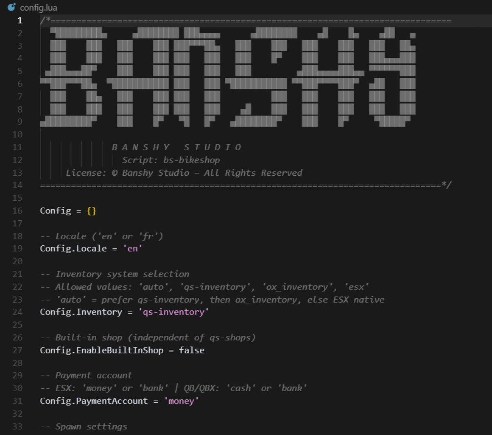

## Customisation


All settings are in `shared/config.lua`. Here are the key options to adapt the resource to your economy and gameplay preferences.


### Language
```lua
-- 'en' or 'fr' (other languages are prepared in locales)
Config.Locale = 'en'
```

`shared/locales.lua` contains EN/FR + 12 other languages. The function `T(key, ...)` automatically selects the configured language.

### Inventory
```lua
-- 'auto' = QS > OX > ESX
Config.Inventory = 'auto' -- 'auto' | 'qs-inventory' | 'ox_inventory' | 'esx'
```

### Built-in shop
```lua
-- Enable the internal shop (ox_target zones + ox_lib menu)
Config.EnableBuiltInShop = false

-- Payment account
-- ESX: 'money' or 'bank' | QB/QBX: 'cash' or 'bank'
Config.PaymentAccount = 'money'

-- Items and prices
Config.Products = {
  { name = 'bmx',      label = 'BMX',        price = 1000 },
  { name = 'cruiser',  label = 'Cruiser',    price = 1200 },
  { name = 'fixter',   label = 'Fixter',     price = 1500 },
  { name = 'scorcher', label = 'Scorcher',   price = 1500 },
  { name = 'tribike',  label = 'Whippet',    price = 1500 },
  { name = 'tribike2', label = 'Endurex',    price = 1500 },
  { name = 'tribike3', label = 'Tri-Cycles', price = 2000 },
}

-- Shop locations (zones)
Config.Locations = {
  { coords = vec4(-1223.0, -1435.05, 4.37, 130.0), label = 'Bike Shop' },
}
```

### Bike spawn
```lua
Config.Spawn = {
  offset = vector3(2.0, 0.0, 0.3), -- position relative to the player
  seatInto = true,                  -- seat the player automatically
  platePrefix = 'BIKE',             -- plate prefix
  cooldownSeconds = 3,              -- anti‑spam delay
  safeSpawnCheck = false,           -- if you have a free‑area checker
  safeRadius = 1.5                  -- radius for the checker
}
```

### Packing (ox_target)
```lua
Config.Pack = {
  enable = true,
  distance = 2.0,       -- interaction distance
  ownerOnly = true,     -- only the owner can pack
  maxPackRange = 5.0,   -- max player ↔ bike distance, server‑side
}
```

### Restrictions (anti‑abuse)
```lua
Config.Restrictions = {
  singleBikePerPlayer = true, -- limit to 1 bike item per player
  bikeItems = { 'bmx', 'cruiser', 'fixter', 'scorcher', 'tribike', 'tribike2', 'tribike3' }
}
```

If you use QS Shops, the server applies a post‑purchase check and removes extra items, notifying the player.

### Supported models and ox_target
Supported client‑side models: `bmx`, `cruiser`, `fixter`, `scorcher`, `tribike`, `tribike2`, `tribike3`.

`ox_target` automatically adds the "Pack the bike" option on these models, with ownership control if `ownerOnly = true`.

### Add a new bike (example)
1) Add the item in your inventory (QS/OX/ESX) with image if QS.
2) Add its name to `Config.Restrictions.bikeItems`.
3) Add an entry to `Config.Products` if you want to sell it via the built‑in shop.
4) If the model has a different name, make sure to use it as the spawn `model` on the client side (event `bs-bikeshop:useBikeItem`).


