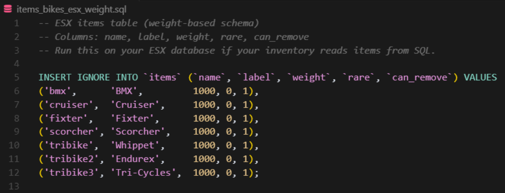

## Installation


This guide covers full installation of `bs-bikeshop` for QS Inventory, OX Inventory, or native ESX, as well as optionally enabling the built-in shop.

### 1) Prerequisites
- Framework: ESX, QB or QBX (standalone possible, but money/back‑office requires a framework)
- Dependencies: `ox_lib`, `ox_target`

In `server.cfg` (ensure order):

```cfg
ensure ox_lib
ensure ox_target
ensure bs-bikeshop
```

### 2) Drop the resource
Place the `bs-bikeshop` folder into your resources directory, then add the lines above to `server.cfg`.

### 3) Integrate the items for your inventory

Inventory selection in `shared/config.lua`:

```lua
-- 'auto' will try QS, then OX, else ESX
Config.Inventory = 'auto' -- values: 'auto' | 'qs-inventory' | 'ox_inventory' | 'esx'
```

#### QS Inventory
1. Open `qs-inventory/shared/items.lua`.
2. Copy the snippet from `install/qs_inventory_items.lua`.
3. Copy the images from `install/items/` to `qs-inventory/html/images/`.
4. Restart `qs-inventory` then `bs-bikeshop`.

QS notes:
- Items are marked `unique = true` and `useable = true`.
- Script item names: `bmx`, `cruiser`, `fixter`, `scorcher`, `tribike`, `tribike2`, `tribike3`.

#### OX Inventory
Option A: merge into `ox_inventory/data/items.lua` the entries from the snippet `install/ox_inventory_items.lua`.


Option B: if you manage your items via a separate file, adapt the structure (label, weight, stack, consume) to your existing schema.


Restart `ox_inventory` then `bs-bikeshop`.

#### Native ESX (items in SQL)
1. Choose your schema: weight or limit.
   - Weight schema: import `install/items_bikes_esx_weight.sql`
   - Limit schema: import `install/items_bikes_esx_limit.sql`



2. Restart the inventory/server.

### 4) Verify in-game
1. Give yourself an item (e.g., via admin command or panel) `bmx`.
2. Use the item: a bike spawns next to you with a random plate.
3. Target the bike with `ox_target` → "Pack the bike" to get the item back.

### 5) Enable the built-in shop (optional)
The built-in shop uses `ox_target` to display a contextual `ox_lib` menu.

In `shared/config.lua`:

```lua
Config.EnableBuiltInShop = true

-- Items for sale (prices and item names)
Config.Products = {
  { name = 'bmx',      label = 'BMX',        price = 1000 },
  { name = 'cruiser',  label = 'Cruiser',    price = 1200 },
  { name = 'fixter',   label = 'Fixter',     price = 1500 },
  { name = 'scorcher', label = 'Scorcher',   price = 1500 },
  { name = 'tribike',  label = 'Whippet',    price = 1500 },
  { name = 'tribike2', label = 'Endurex',    price = 1500 },
  { name = 'tribike3', label = 'Tri-Cycles', price = 2000 },
}

-- Locations (ox_target zones)
Config.Locations = {
  { coords = vec4(-1223.0, -1435.05, 4.37, 130.0), label = 'Bike Shop' },
}
```

Payment account (server):

```lua
-- ESX: 'money' or 'bank' | QB/QBX: 'cash' or 'bank'
Config.PaymentAccount = 'money'
```

### 6) Quick troubleshooting
- No "Pack the bike" option? Check `ox_target` and that the model is supported (list in `client/client.lua`).
- Item not returned when packing? The inventory must be able to hold the item (weight/slots). The script checks capacity before deleting the vehicle.
- Shop purchase not working? Check funds (`Config.PaymentAccount`) and the framework detected server-side.
- Bike duplicates? The anti‑abuse option limits 1 bike per player (see Customisation to adjust).


