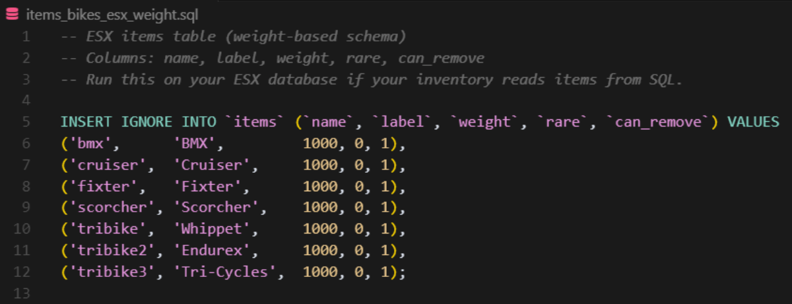

# BS-DefenseCayo

Transform Cayo Perico into a fully fortified, living military stronghold for FiveM. Packed with AI guards, dynamic patrols, vehicles, and heavy weaponry — with automatic respawn — this resource delivers relentless protection and action‑ready RP scenarios.

## Overview

Cayo Perico Defense transforms the island into a fully fortified military stronghold for FiveM. Packed with AI guards, patrols, vehicles, and heavy weaponry — all with automatic respawn — this script delivers relentless protection and action‑packed RP scenarios.

## Dynamic Patrol System

- Land, sea, and vehicle patrols across the entire island
- Configurable defense zones: villa, docks, runway, secondary entrance, more
- Pre‑equipped with rifles, RPGs, snipers, and mounted weapons

## Aggressive AI Combat

- Guards auto‑engage any player within range
- Optimized combat behavior with high accuracy and armor
- Automatic respawn keeps the defense alive and active

## Vehicles & Heavy Support

- Armored vehicles, barracks, technicals with gunners
- Armed dinghy5 boats for sea defense
- Static and mobile heavy weapon units

## Easy Configuration

- Framework: ESX (standalone friendly)
- Defense zones, weapons, health, and armor easily adjustable
- No core edits, drop‑in ready

## Optimized & Event‑Ready

- Runs smoothly on populated servers
- Perfect for RP heists, military missions, or event defense scenarios
- Clean and organized resource structure

## What You Get & Setup

- Pre‑built defense presets for key areas (villa, docks, runway, secondary entrance)
- Modular patrol routes (land/sea/vehicle) with adjustable density
- Guard loadouts (rifles, snipers, RPGs, mounted weapons)
- Automatic respawn with cooldowns and anti‑spam safeguards
- Clean, organized resource structure

### Setup in 3 steps
1. Drop the `bs-defensecayo` resource and start it after your framework.
2. Configure zones, weapons, and AI behavior in `shared/config.lua`.
3. Restart your server — Cayo Perico is now a military fortress.

## Requirements

- FiveM (Cfx.re) server (recent artifacts)
- Framework: **ESX** recommended (standalone friendly)

## Getting Help

Use the pages in this section for Installation, Quickstart, Configuration, Troubleshooting, and FAQ. When requesting support, include server/client logs and your key configuration sections.

Keywords: FiveM Cayo Perico defense, ESX, AI guards, vehicle patrols, RPGs, snipers, armored vehicles, dinghy5, optimized combat, event‑ready

